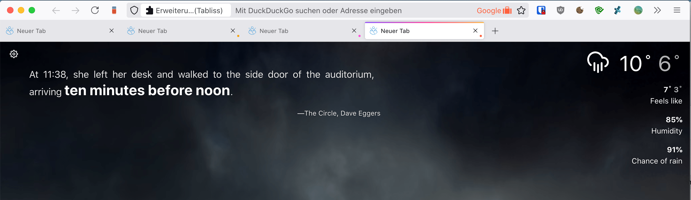

# Proton Redux for Firefox

userChrome.css modifications to mitigate some of Protons weaknesses while keeping it Proton-ish.

Comment/Uncomment [L23-L26](https://github.com/entepe85/proton-redux/blob/97be02332f6a9fbbad6515ac3da6f869f2fbd336/userChrome.css#L23-L26) in userChrome.css to enable the system accent colour or the Firefox brand gradient as the active tab indicator.

